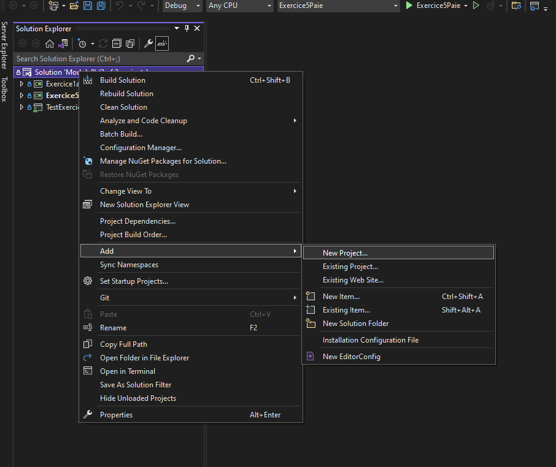
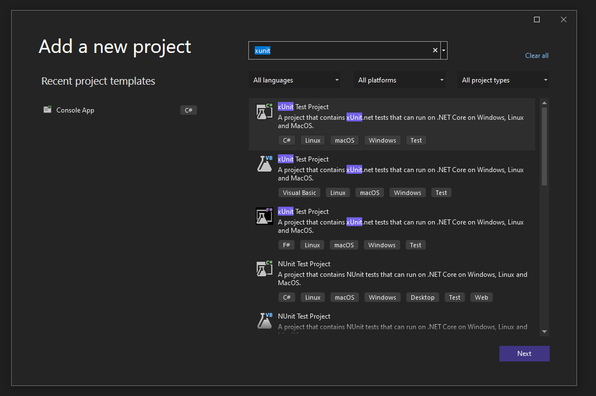
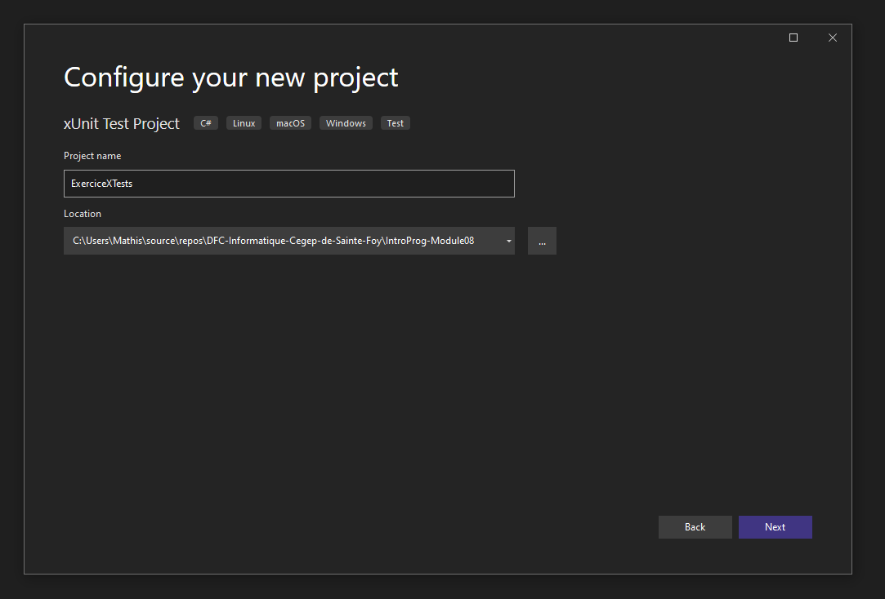
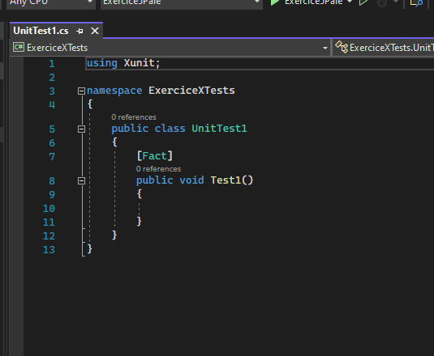

# Ajouter un projet de tests

**Les noms de projets dans les captures d'écran peuvent être inexacts car il s'agit d'une procédure générale**
1. Faites un clic droit sur votre solution et choisisez l'option *Ajouter* -> *Nouveau Projet*. 
2. Dans la fenêtre de dialogue, écrivez ```xunit``` dans la barre de recherche et choisisez le projet de test *xUnit* en c#. 
3. Nommez votre projet et cliquez suivant jusqu'a ce que le projet soit crée. 
4. Le projet devrais maitenant être crée et un exemple de test devrais être affiché. 