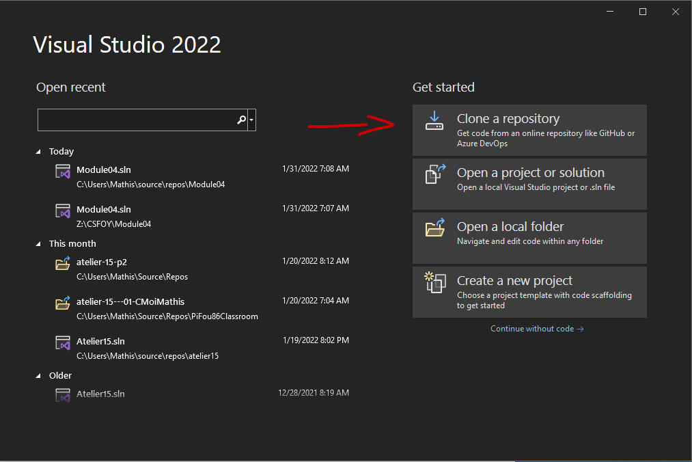
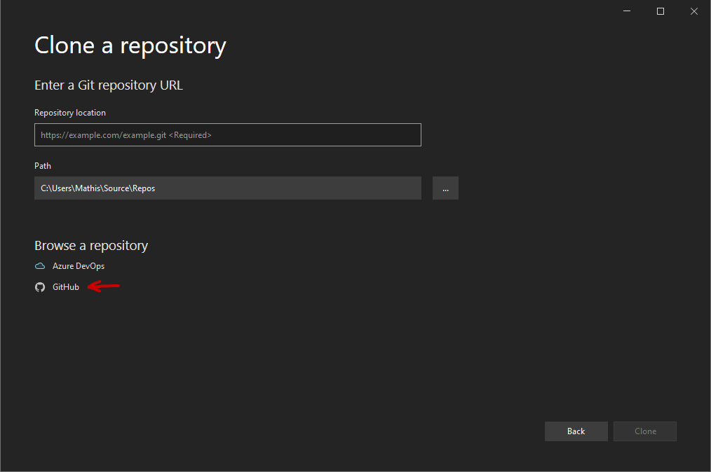
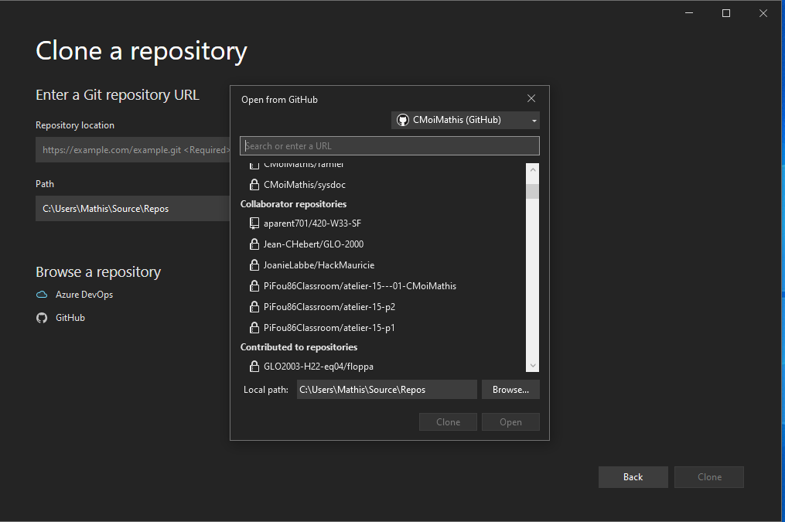
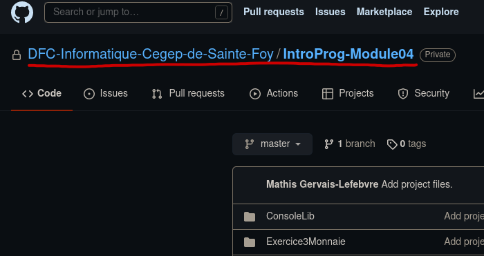
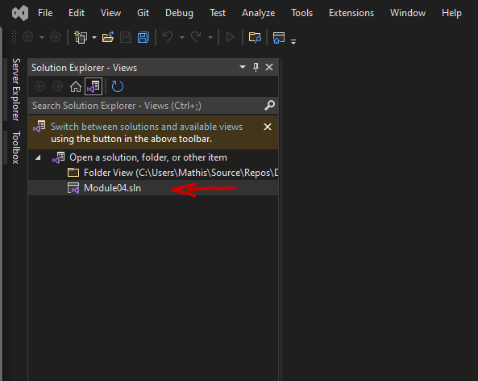
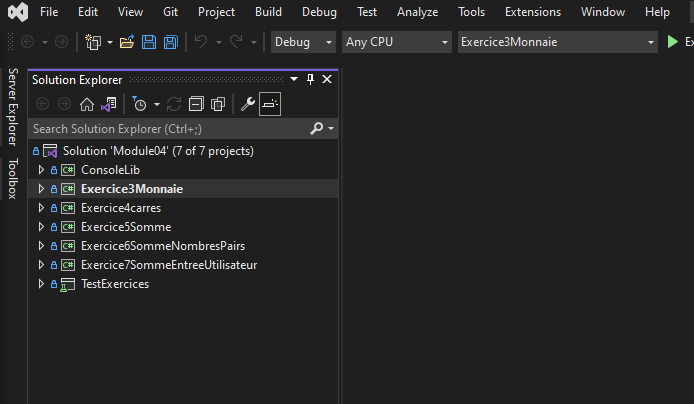

# Cloner un dépot

**Les noms de projets dans les captures d'écran peuvent être inexacts car il s'agit d'une procédure générale**
1. Ouvrez visual studio.
2. Cliquez sur clonez un dépot.

3. Cliquez sur GitHub.

4. Selectionnez le dépot que vous voulez cloner. 

Il se peut qu'a cette étape Visual Studio vous demande de vous ré-authentifier à github. Suivez les étapes à l'écran pour procéder.

Le nom du dépot se trouve en haut de la page GitHub qui contient votre dépot.

5. Lorsque le processus de clonage sera terminé, double cliquez sur la solution (le fichier qui se termine par .sln) à partir de l'explorateur de solution.

Vous devriez voir par la suite les différents projets qui sont contenus dans la solution.
