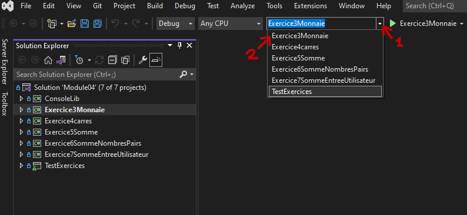
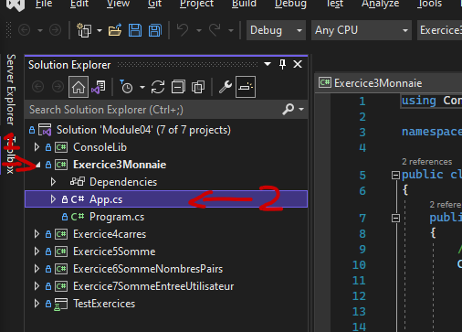
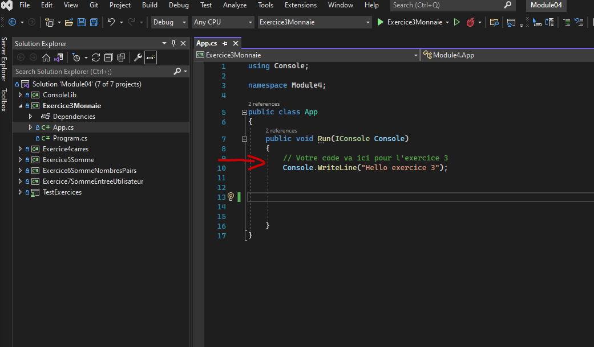

# Sélectionner un projet à exécuter
Il y a plusieurs projets dans cette solution. Vous pouvez les voirs comme différents programmes indépendants.

Pour compléter les exercices, vous devrez mettre votre solution de chaque numéro dans son projet correspondant.

Donc, pour sélectionner un projet, commencez par le sélectionner en haut de votre EDI.

Ensuite, ouvrez le fichier (double click) où vous devrez écrire votre code. Il s'apelle App.cs.

Finalement vous pouvez écrire votre code de solution à l'intérieur des crochets.
