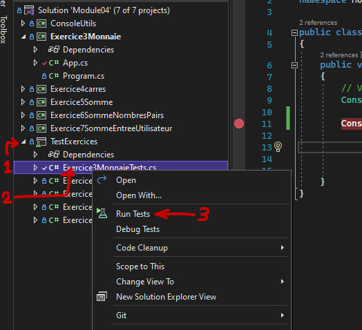
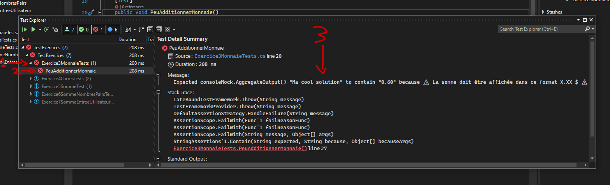
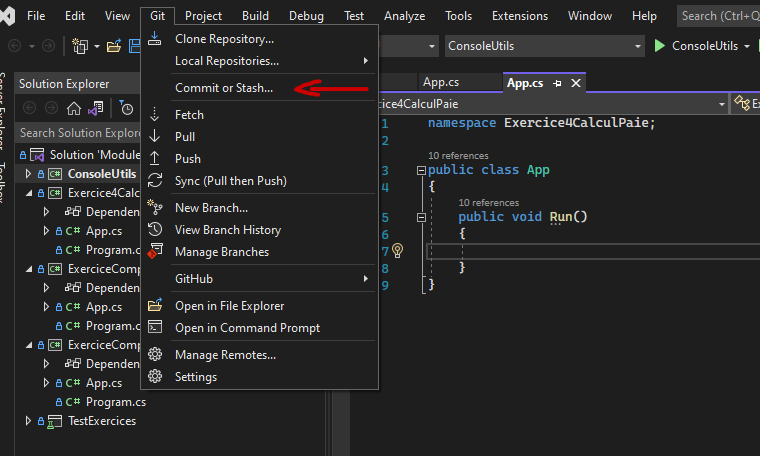
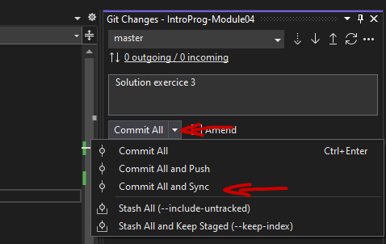

## Vérifier votre solution
1. Lorsque vous avez terminé de coder votre solution, vous pouvez la tester en exécutant les tests founis avec la solution. Clickez sur l'indicateur comme montré dans l'image ci-dessous.

Vous pourrez voir les résultats dans la fenêtre qui apparait. Si un crochet vert apparait, le test passe ! 

Si il y as un X rouge, vous pouvez suivre les instructions ci bas pour avoir plus de détail sur l'échec du test.

2. Lorsque tous les tests passent, utiliser le menu de modification git pour envoyer vos modifications sur GitHub.

